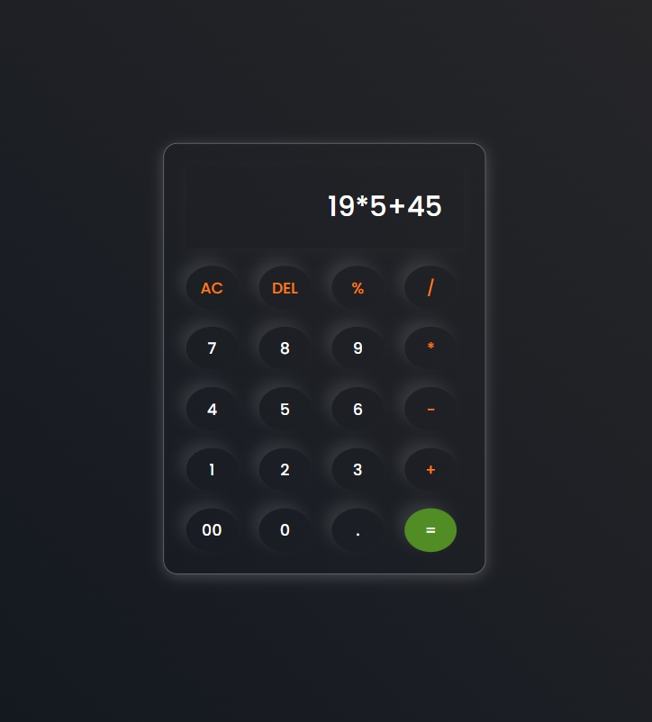

# Calculator ✨

A stylish, responsive, and functional calculator web application.Built with HTML, CSS, and JavaScript, this project demonstrates clean coding practices, modular functions, and a polished user interface.

# Highlights at a Glance 🚀

📱 Responsive Design: Looks perfect on any device—desktop, tablet, or mobile.

⚡ Seamless Calculations: Perform basic arithmetic operations effortlessly.

🚀 Error Handling: Never crash! Meaningful error messages ensure a smooth user experience.

🌈 Modern UI: A gradient background for a premium look.

🎯 User-Friendly: Easy to use with intuitive controls like AC, DEL, and decimals.

---

# Technologies Used 🔍

- `HTML5`: Structuring the interface.

- `CSS3`: Crafting a responsive and visually appealing design.

- `JavaScript (ES6+)`: Powering the core functionality with modern methods.

---

# Features in Detail 🛠️

AC Button	Clears all input and resets the calculator.
DEL Button	Deletes the last entered digit/operator.
Decimal Support	Ensures only one decimal is added per number.
Error Messages	Displays "Error" for invalid operations (e.g., 1/0).
Responsive UI	Optimized for devices of all sizes, with dynamic font and button sizes.

---

# Visual Sneak Peek 📸

Desktop View


Mobile View



---

# Future Enhancements 🔮

🌟 Scientific Calculator Mode: Add square roots, exponents, and trigonometric functions.

🌙 Theme Switcher: Allow users to toggle between light and dark themes.

⌨️ Keyboard Support: Enhance usability with keyboard shortcuts for all operations.

---

## Installation ⚙️

To run these projects locally:

1. Clone this repository:
   ```bash
   git clone https://github.com/khushi05sharma/MathMate.git

---

# License 📜

This project is licensed under the MIT License.